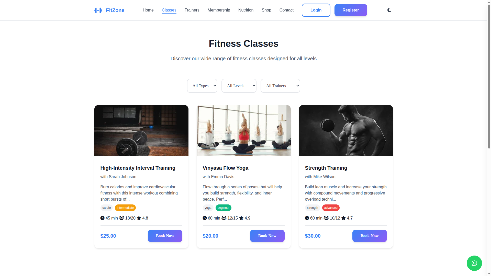
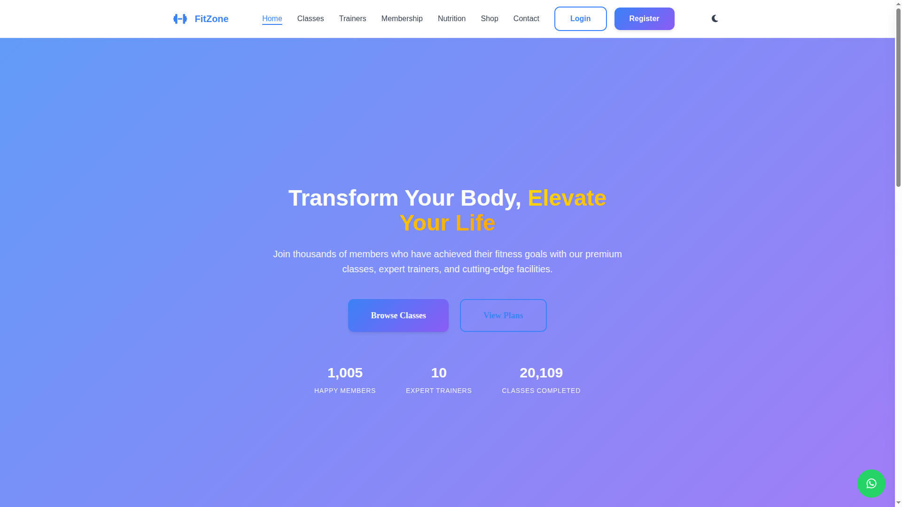
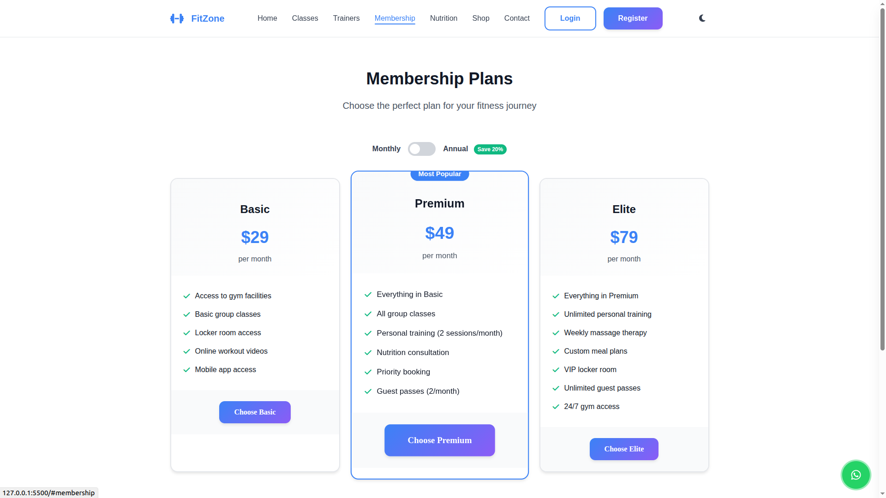
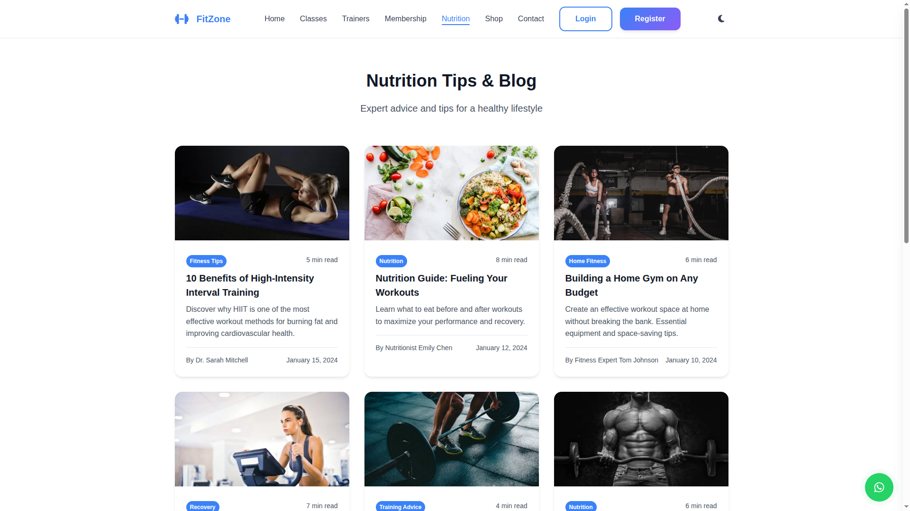
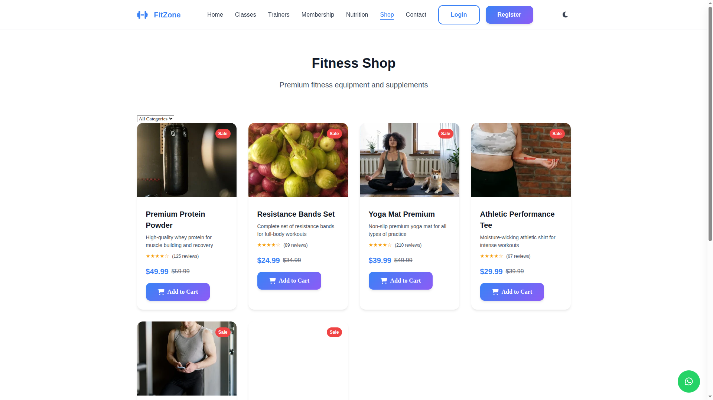
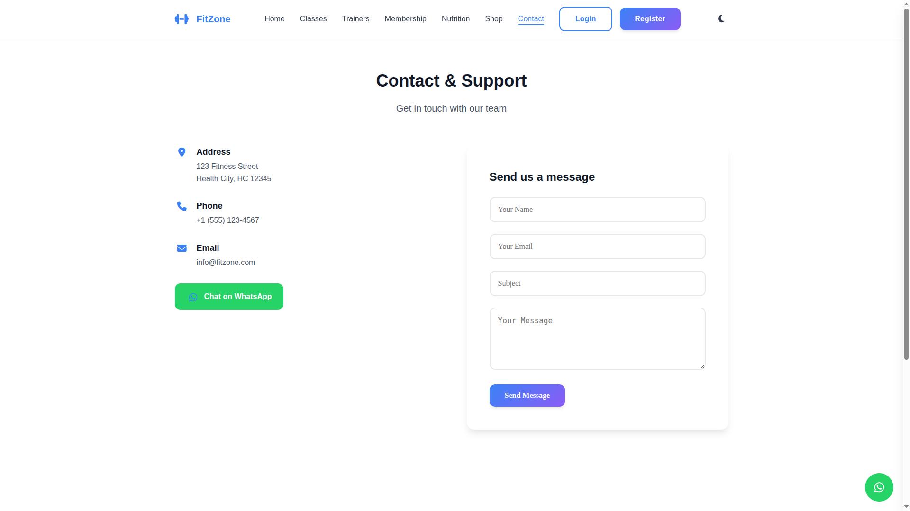
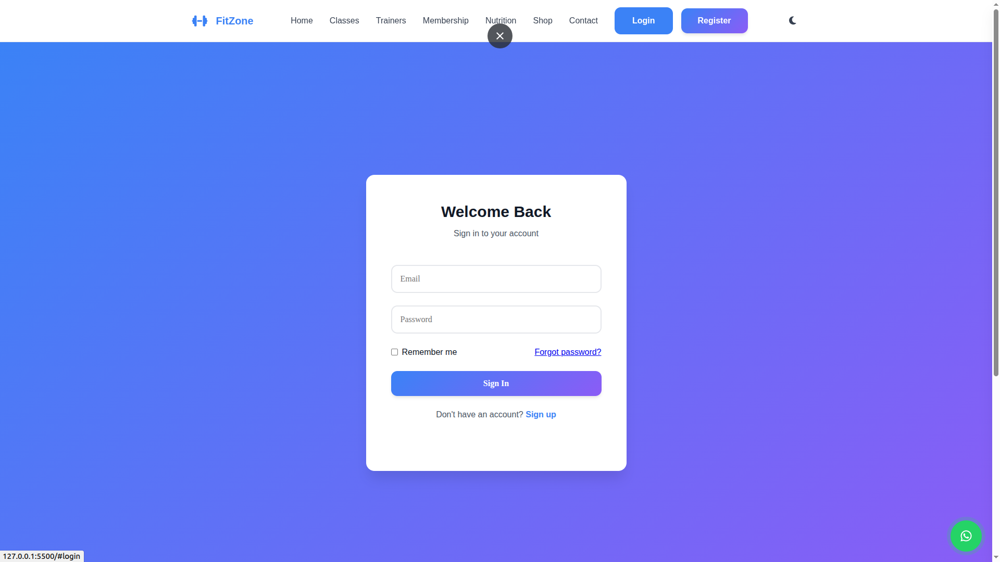
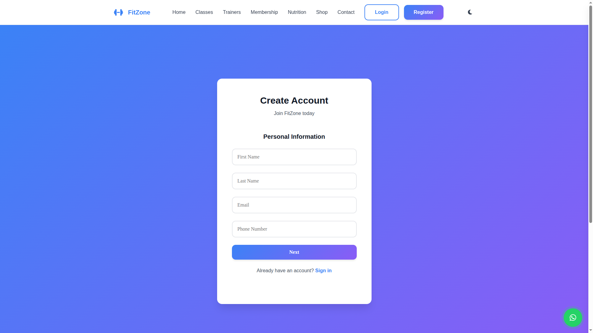
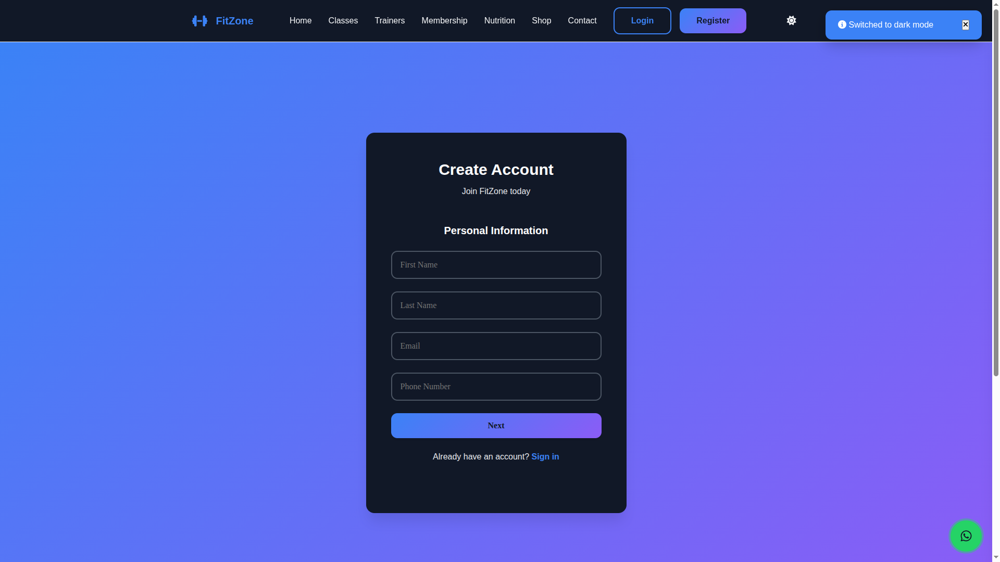

Absolutely! Here's a **detailed `README.md`** file for your **FitZone** project, incorporating all the features you mentioned:

---

### 📄 `README.md` (Detailed for GitHub)


# 🏋️‍♀️ FitZone

**FitZone** is a modern, responsive front-end fitness website created using **HTML**, **CSS**, and **JavaScript**. This project provides an engaging user experience for fitness enthusiasts and gym-goers looking to explore classes, connect with trainers, and access fitness resources — all in one place.

---

## 🌟 Features

FitZone includes the following key sections:

### 🏠 Home
- Engaging hero banner
- Welcome message introducing FitZone
- Navigation to all major sections

### 🧘‍♂️ Classes
- List of fitness classes (Yoga, HIIT, Zumba, Cardio, etc.)
- Class schedules and trainer assignments

### 🏋️ Trainers
- Trainer profiles with images, bios, and expertise
- Social media/contact links (optional)

### 💳 Membership
- Details of available membership plans (Monthly, Quarterly, Annual)
- Features included in each plan
- Call-to-action buttons for joining

### 🥗 Nutrition
- Nutrition plans for various fitness goals (weight loss, muscle gain, etc.)
- Healthy recipes, meal plans, and tips

### 🛍️ Shop
- Basic e-commerce UI for gym gear, apparel, and supplements
- Product listings with price and description

### 📞 Contact
- Contact form with fields: name, email, message
- Location and support information

### 🔐 Login & Register
- User authentication UI for login and signup
- Placeholder functionality using front-end only

---

## 📷 Screenshots

> Home Page


> Classes Page


> Trainers Page


> Membership Page


> Nutrition Page


> Shop Page


> Contact Page


> Login Page 


> Register Page


> Night Mode 

---

## 🛠️ Built With

- ✅ HTML5
- 🎨 CSS3 (Flexbox/Grid)
- ✨ JavaScript (Vanilla)

---

## 📁 Project Structure

```

fitzone/
├── index.html        # Main HTML page
├── style.css         # Main stylesheet
├── script.js         # JavaScript for interactions
└── README.md         # Project documentation

````

---

## 💡 Future Enhancements

- Integrate backend for authentication (Node.js/Firebase)
- Connect contact form to email or database
- Add cart and payment integration in the shop
- Responsive animations and transitions
- Store BMI or user data using localStorage or backend

---

## 🚀 Getting Started

To view or edit this project locally:

1. Clone the repository:
   ```bash
   git clone https://github.com/Aparnaraha/FitZone.git
   cd fitzone
2. Open `index.html` in your browser or live server.

---

## 🤝 Contributing

Contributions are welcome! Please fork the repository, make your changes, and submit a pull request. If you find any bugs or issues, feel free to open an issue.

---

## 📄 License

This project is licensed under the [MIT License](LICENSE).

---

## 🙋‍♀️ Author

**Your Name**
[GitHub Profile](https://github.com/Aparnaraha)
[LinkedIn](https://linkedin.com/in/aparnaraha0) *(optional)*

---

## 📬 Contact

For any queries or suggestions:
📧 [aparnaraha0@gmail.com](mailto:aparnaraha0@gmail.com)

---

> Built with passion and purpose. Stay fit with **FitZone** 💪


